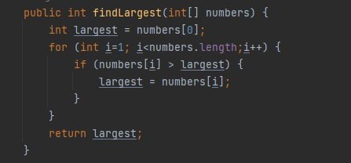
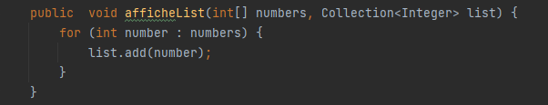

<h1>Ribatis - Stage PFE 2023</h1>
<h2>Exercice 1</h2>

Ecrivez un programme en JAVA avec les fonctions suivantes :

-une méthode findLargest(int[] numbers) qui retourne le plus grand nombre dans numbers.

-une méthode afficheList(int[] numbers,Collection<?> list) qui ajoute les nombres dans une liste de type collection.

-une méthode afficheList(Collection<?> list) qui parcourt une liste et affiche son contenu.

-une méthode removeElementByValue(Collection<?> list) qui supprime un élément dans la liste recherché par une valeur dans le contenu da la liste .

<h5>Jeu d'essai</h5>

<h5>Test</h5>

<h2>Exercice 2</h2>
<a href="index.html">Exercice 2<a>
